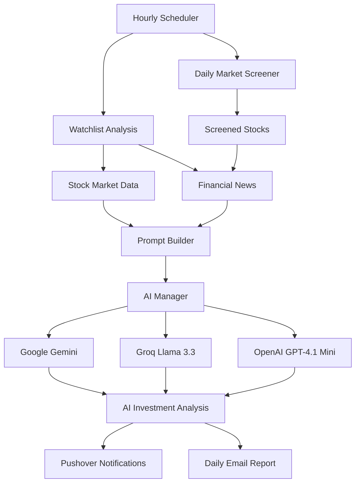
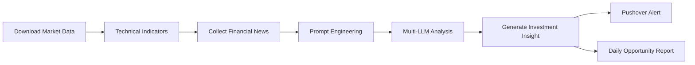
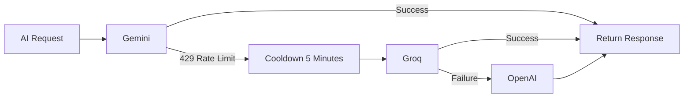

# 🚀 LLM News Intelligence

<div align="center">

### AI-powered Financial Market Intelligence Platform

Monitor stocks • Analyze financial news • Detect opportunities • Deliver AI-powered insights


</div>

---

# 📌 Overview

LLM News Intelligence is an autonomous financial market intelligence platform that continuously monitors stocks, collects financial news, performs AI-driven analysis using multiple LLM providers, and delivers actionable investment insights.

Instead of manually checking dozens of financial websites every day, the platform automates the entire workflow.

## Core Capabilities

- 📈 Monitor a configurable watchlist
- 📰 Aggregate latest financial news
- 📊 Calculate technical indicators
- 🤖 Analyze data using multiple LLM providers
- 🚨 Send instant mobile notifications
- 📧 Generate daily opportunity reports
- 🔄 Automatic AI provider failover

---

# 🏗 System Architecture



---

# 🚀 Workflow



---

# 🤖 AI Architecture

The platform is completely model-agnostic.

Instead of depending on a single AI provider, every request is routed through a centralized AI Manager.

Supported providers:

| Provider | Role |
|----------|------|
| Google Gemini | Primary |
| Groq (Llama 3.3 70B) | Secondary |
| OpenAI GPT-4.1 Mini | Final fallback |

---

# 🔄 Smart Failover

If one provider becomes unavailable, the next provider automatically continues the analysis.



### Features

- Automatic provider switching
- Rate-limit detection
- Circuit breaker
- Cooldown management
- Zero manual intervention

---

# 📈 Technical Analysis

Every monitored stock is analyzed using:

- RSI
- MACD
- Bollinger Bands
- ATR
- SMA 20
- SMA 50
- SMA 200
- Stochastic Oscillator
- Volume Analysis
- Daily Price Movement

---

# 📰 AI News Intelligence

Financial news is combined with technical indicators.

The AI evaluates:

- Market sentiment
- Technical trend
- News impact
- Investment risk
- Buy/Sell signal
- Confidence level

Instead of simply summarizing news, the system generates concise investment insights.

---

# 📲 Notification System

## Instant Mobile Alerts

Watchlist stocks are sent via **Pushover**.

Example:

```text
🟢 NVDA

SIGNAL : BUY

Confidence : High

Positive news combined with an oversold RSI suggests a potential buying opportunity.

Watch : $175 support level
```

---

## Daily Opportunity Report

The market screener automatically scans the market and sends an email report containing:

- Top opportunities
- AI-generated summaries
- Risk evaluation
- Technical signals

---

# 🛠 Technology Stack

| Category | Technologies |
|-----------|--------------|
| Language | Python |
| AI | OpenAI, Gemini, Groq |
| Market Data | Finnhub API-News API | 
| HTTP | Requests |
| Notifications | Pushover |
| Reports | SMTP Email |
| Logging | Python Logging |
| Scheduling | Hourly Runner |

---

# 📂 Project Structure

```text
llm-news-intelligence/

├── config/
│
├── modules/
│   ├── ai_manager.py
│   ├── prompt_builder.py
│   ├── news_fetcher.py
│   ├── notifier.py
│   ├── opportunity_analyzer.py
│   ├── screener.py
│   └── stock_data.py
│
├── logs/
│
├── main.py
│
├── requirements.txt
│
└── README.md
```

---

# 🎯 Roadmap

- Claude support
- Mistral support
- Ollama integration
- Docker deployment
- FastAPI API
- Web Dashboard
- Portfolio Optimization
- AI Agent Workflow
- Vector Database Support

---

# 💡 Why This Project?

This project demonstrates practical experience with:

- Multi-LLM orchestration
- AI workflow automation
- Financial data analysis
- Prompt engineering
- Fault-tolerant architecture
- API integrations
- Autonomous AI systems

---

## ⚠️ Disclaimer

This project is intended for educational and research purposes only.

The generated analyses, investment signals, and market insights are produced by AI models and should not be considered financial or investment advice.

Always conduct your own research before making investment decisions.

# 👨‍💻 Author

**Onur Çulha**

Business Analyst • AI Product Enthusiast • LLM Applications • Intelligent Automation

---

⭐ If you found this project interesting, feel free to star the repository.
